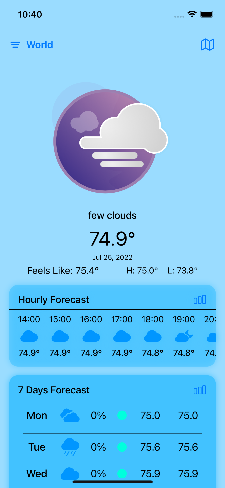
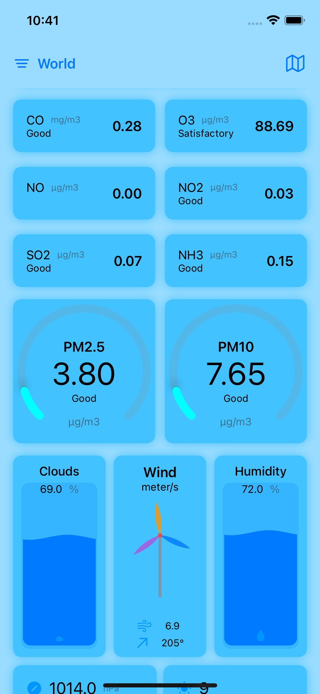
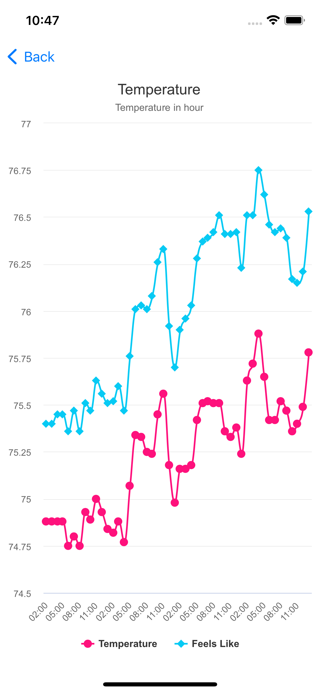

# Clima

&nbsp;&nbsp;&nbsp;&nbsp;&nbsp;&nbsp;

---

### How to Deploy
1. Get your weather data API key from [OpenWeatherMap](https://openweathermap.org/price)
2. Replace the API key in Clima/WebService/WeatherDataService.swift with yours

then the app will fetch weather data with your API key

**Note**

Clima still have many unfinished functionalities. i.e. map is presented with testing data, etc.

Bugs may exist and need further improvement。

 

### Credits
- [lottie-ios](https://github.com/airbnb/lottie-ios)
- [AAChartKit-Swift](https://github.com/AAChartModel/AAChartKit-Swift)
- [OpenWeatherMap](https://openweathermap.org): weather data source
- [LottieFiles](https://lottiefiles.com): in app lottie animations source

## 